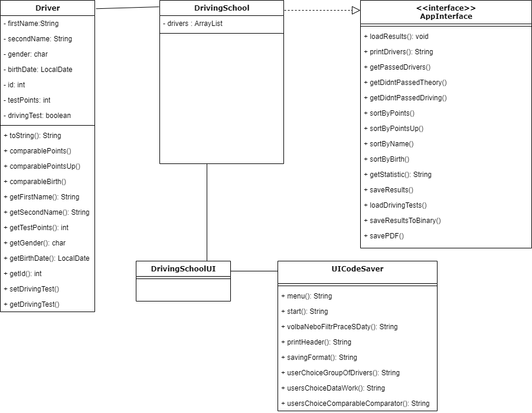

# 2021ALG2Semestral-Vesely-Autoskola
<h3> Zádání práce </h3>
Program autoškola bude zpracovávat výsledky autoškoly po teoretických testech a závěrečných zkouškách. Vstupem jsou 2 textové soubory - soubor všech účastníků s počtem bodů z teoretického testu a soubor, zda zvládli závěrečné jízdy (účastníci s malým počtem bodů zde nejsou). První soubor obsahuje jméno, přijímení, pohlaví, počet bodů a datum narození. Druhý soubor obsahuje jméno, přijímení a boolean, zda zvládli závěrečné zkoušky. Data v souborech jsou odděleny čárkou. 
Program umožňuje uživateli zobrazit, jací žáci udělali písemné testy, jací udělali kompletní autoškoly, jací neudělali závěrečné testy, nebo jací nesplnili ani jedno. Následně program umožní filtrování dle pohlaví, nebo setřídění dle počtu bodů, nebo třídění dle křestního jména. Následně se program ptá uživatele, zda chce vybraný soubor uložit, případně do jakého formátu (formát pdf přes externí knihovnu zatím nefunguje kvůli java.util.List, které není kompatibilní s druhou knihovnou). Po uložení může uživatel spustit program znovu.
<h3> Návrh řešení </h3>
<h4> Funkční specifikace </h4>

Menu -> výběr jaké účastníky chce uživatel zobrazit

1. seznam všech účastníků 

2. seznam účastníků, kteří udělali autoškolu

3. seznam účastníků, kteří neudělali teoretické testy

4. seznam účastníků, kteří neudělali závěrečné testy

Filtrovací menu -> jak chce uživatel setřídit/filtrovat zvolený seznam
- dle pohlaví, dle počtu bodů, dle data narození, dle jména
<h4> Popis struktury vstupních a výstupních souborů </h4>
Vstup obsahuje typy String, int, LocalDate a boolean, jsou odděleny čárkou, testované soubory byly formátu .csv
Výstupní formáty jsou .txt, .csv a v budoucnu .pdf s použitím externí knihovny iText
<h4> Class diagram </h4>

<h3> Příprava na testování </h3>

 Vytvořené testovací soubory mají 21 řádků i se záhlavím první, druhý cca 10 řádků

<h5> test 1 </h5>
  
 Testován běžný vstup, nejlehčí pro chod programu, bez ukládání - výsledek dle očekávání 

<h5> test 2 </h5>
  
 Testován běžný vstup s ukládáním do .txt - výsledek dle očekávání 

<h5> test 3 </h5>
  
 Testován běžný vstup s ukládáním do .csv - výsledek dle očekávání 

<h5> test 4 </h5>
  
 Testován limitní stav, místo int vložení des. čísla - výsledek dle očekávání, program se restartoval (je ošetřen) 

<h5> test 5 </h5>
  
 Testován limitní stav, místo int zadán String - výsledek, program se restartoval(je ošetřen) 

<h5> test 6 </h5>
  
 Testován limitní stav, neplatný název vstupního souboru - výsledek dle očekání, program nespadl a žádal o validní vstup 

<h5> test 7 </h5>
  
 Testován limitní stav, ukládání souboru s diakritikou - výsledek, soubor se uložil, jde otevřít, název jsou otazníky 

<h5> test 8 </h5>
  
 Testován limitní stav, ukládání souboru s neplatnými znaky - soubor se neuložil, program odmítl a chtěl jiný název 

<h3> Popis fungování externí knihovny </h3>
Externí knihovna iText mi umožnila ukládat výsledná data do formátu PDF, dlouho jsem řešil, že mi verze iText nefungovala (ani na "helloworld"). Kontaktoval jsem kolegu, který mi poslal jinou verzi iText a v té už ukládat data šla. 
